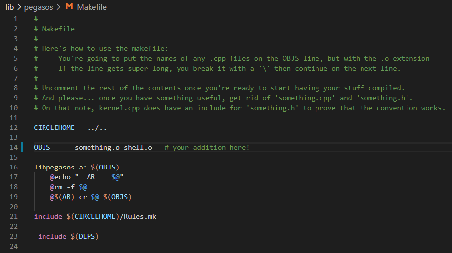

# 2.0.0 PegasOS Cuts and Edits

A number of aspects in PegasOS had to be changed due to time constraints, largely due to the ambitious nature of the original requirements. As this is an entirely student-driven project, none of us were fully aware of the exact time frames each component within the system would require - and neither could we know.

Time was spent in getting a completely bare-bones, driverless system off the ground as our original intention was to create the keyboard driver ourselves so that the system was all new code purpose-made for our system. Quickly this was abandoned, and we searched for open-source keyboard drivers that worked with the desired platform - the Pi 4 - that were not dependent on other systems or architectures. This again had to be abandoned, as no drivers that fit this bill existed. It was through this process that Circle was discovered, and the decision was made to rebase the project in C++ and around the structure of Circle.

This final restructuring has resulted in a number of planned features being either modified or removed due to time constraints. As such, we will discuss the cut features first, and the modified features second.

## 2.1.0 PegasOS Component Cuts

The cut features are any requirements and/or stretch goals mentioned in the original document that have been removed in scope and/or requirement and/or stretch goals from the final project. The following features have been removed entirely from the project:

## 2.1.1 PegasOS Miscellaneous Programs

Pretty much every single miscellaneous program was cut from the project. These were all of the ideas under *Christopher’s Ideas*, *Kenny’s Ideas*, *Jacqueline’s Ideas*, *Jacob's Ideas* and *Giancarlo’s Ideas*. If a program was saved and made its way into the shell or otherwise into the first release of PegasOS, it will appear in the *PegasOS First Release* section.

## 2.1.2 PegasOS System Configuration

By System Configuration, we namely mean System Localization and Location. While some of this can be edited through Circle’s keyboard configuration settings and timezone settings, PegasOS itself does not have the previously described Language packs or Location settings for time zones.

## 2.1.3 PegasOS Program Execution

Unfortunately, we were not able to determine a way to load and execute binaries from within PegasOS with the time we had. Based on what we know about Circle and how PegasOS has developed, we believe that a system rework of the task system and scheduler would be necessary in order to facilitate the execution of program binaries.

However, there is still a way to get custom programs to execute on the system. This consists of four steps:
1. Place the program’s header file in the /include/pegasos directory of the project.
2. Place the program’s source code file in the /lib/pegasos directory, and add its name followed by the extension .o to the Makefile in that directory. Like so:

  

3. Create a command to execute the program within the PegasOS shell, inside of shell.cpp in /lib/pegasos
4. Compile PegasOS and run on your device.

## 2.1.4 PegasOS Drive Partitions

While this was not originally a design choice, after achieving a working file system with FAT32 we wanted to allow the system to partition the SD card and still be able to boot off of one of those partitions. This would have also allowed us to use a FAT32 boot partition then have a exFAT data partition on the drive. While we still believe this would be possible on the current system, this is something that we had to cut due to time constraints where the effort was better spent elsewhere.

## 2.2.0 PegasOS Component Edits

Edited features are any requirements and/or stretch goals and/or components of PegasOS that were present in the original design, that have since been changed and no longer reflect in whole or in part their original design. The following features have changed in function and/or scope in the project:

## 2.2.1 PegasOS Scheduler

While PegasOS still contains a scheduler, it is not reflective of the original design pattern, namely in its algorithm. A multi-level feedback queue was not feasible in the time frame after the Circle rebase occurred, and as such we began with a much simpler, straightforward scheduler. We increased its scheduling complexity as time allowed through adding task weights and insertion into the task queue by those weights, but we were not able to achieve the complexity and flexibility of the original design.

Related to the scheduler, we were also not able to have custom binaries executable from within PegasOS. We are fairly certain that this would require extensive reworking of the system due to the reliance on the CTask class for executing tasks through the scheduler. It is possible however, to include custom programs as a part of PegasOS and compile them with the system and the kernel. For more information on this process, refer to the guide on the Documentation repository [here](https://github.com/MrJellimann/PegasOSDocumentation/blob/master/Guides/G_CUSTOMPROGRAM.md).

## 2.2.2 PegasOS Memory

While PegasOS still contains a memory system and through Circle we do have paging support, the pages are not ‘traditionally OS-like’ nor does it provide any sort of real virtualization of memory. This is elaborated on more in [Section 4.2.5](4_PEGASOS_FUTURE.md), and provides suggestions for future groups that tackle the problem.

[Back - 1.0.0 Circle x PegasOS](0_PREFACE_OVERVIEW.md) | [Next - 3.0.0 PegasOS First Release](3_PEGASOS_FIRST_RELEASE.md) | 
[Design Document Home](ADD_DESIGN_DOCUMENT.md) | [Documentation Home](../README.md)