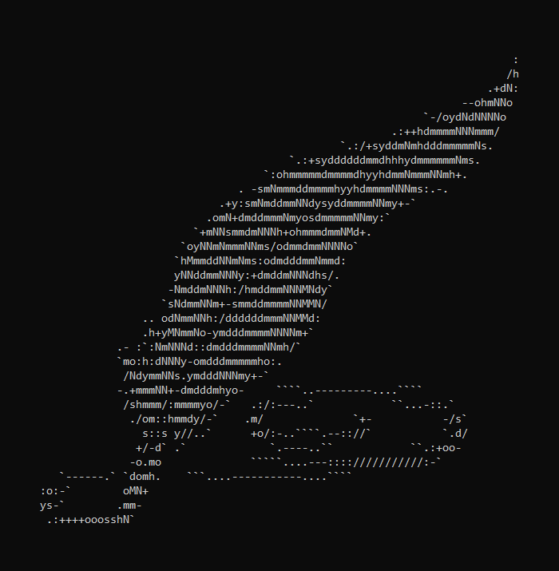

# PegasOS - References

# 10.1 References

## A

Allen, Jay. “New User Tutorial: Basic Shell Commands.” New User Tutorial: Basic Shell Commands, Liquid Web, 6 Sept. 2018, www.liquidweb.com/kb/new-user-tutorial-basic-shell-commands/.

Arpaci-Dusseau, Remzi H., and Andrea C. Arpaci-Dusseau. Operating Systems Three Easy Pieces. Arpaci-Dusseau Books, 2018.

## B

“BCM2711.” BCM2711 - Raspberry Pi Documentation, Raspberry Pi, www.raspberrypi.org/documentation/hardware/raspberrypi/bcm2711/README.md.

“BCM2837.” BCM2837 - Raspberry Pi Documentation, Raspberry Pi, www.raspberrypi.org/documentation/hardware/raspberrypi/bcm2837/README.md.

“BCM2837B0.” BCM2837B0 - Raspberry Pi Documentation, Raspberry Pi, www.raspberrypi.org/documentation/hardware/raspberrypi/bcm2837b0/README.md.

“Boot Sequence.” Boot Sequence - Raspberry Pi Documentation, Raspberry Pi, www.raspberrypi.org/documentation/hardware/raspberrypi/bootmodes/bootflow.md.

## C

Castro, Kristi. “What Are System Calls in Operating System?” Tutorialspoint, 9 Sept. 2018, www.tutorialspoint.com/what-are-system-calls-in-operating-system.

Cawley. “9 Raspberry Pi Operating Systems That Aren't Linux.” MakeUseOf, 3 Sept. 2019, www.makeuseof.com/tag/raspberry-pi-operating-systems-not-linux/.

Curren, Josh. “What Does ‘Int 0x80’ Mean in Assembly Code?” Stack Overflow, Jan. 2010, stackoverflow.com/questions/1817577/what-does-int-0x80-mean-in-assembly-code.

## E

“Ext2.” OSDev Wiki, 1 Oct. 2018, wiki.osdev.org/Ext2.

## F

“FAT.” OSDev Wiki, 9 Oct. 2019, wiki.osdev.org/FAT32.

“File Systems.” OSDev Wiki, 2 Feb. 2020, wiki.osdev.org/File_Systems.

Freenergi, Antonius. “Old Knowledge of x86 Architecture : ‘8086 Interrupt Mechanism.’” Ringlayer Roboticist, 9 Sept. 2014, sw0rdm4n.wordpress.com/category/interrupt-vector-table/.

## G

“GCC Cross-Compiler.” OSDev Wiki, 5 Apr. 2020, wiki.osdev.org/GCC_Cross-Compiler.

“GPIO.” GPIO - Raspberry Pi Documentation, Raspberry Pi, www.raspberrypi.org/documentation/usage/gpio/.

## H

Hasan, Mehedi. “The 50 Most Useful Linux Commands To Run in the Terminal.” UbuntuPIT, 29 Feb. 2020, www.ubuntupit.com/best-linux-commands-to-run-in-the-terminal/.

“How the Linux Kernel Runs a Program.” LinuxInside, 0xax.gitbooks.io/linux-insides/SysCall/linux-syscall-4.html.

Hughes, James. “Raspberrypi/Firmware.” Raspberry Pi Firmware Wiki, Raspberry Pi, 15 Nov. 2019, github.com/raspberrypi/firmware/wiki.

## J

Jones, M. “Evolution of Shells in Linux.” IBM Developer, 9 Dec. 2011, developer.ibm.com/tutorials/l-linux-shells/.

“Journaling.” OSDev Wiki, 1 July 2011, wiki.osdev.org/Journaling.

## K

Kerr, Dave. “Effective Shell Interlude: Understanding the Shell.” Dwmkerr.com, 21 May 2019, dwmkerr.com/effective-shell-part-5-understanding-the-shell/.

King, Tracy. “FAT32 Structure Information - MBR, FAT32 Boot Sector Introduction.” EaseUS, 5 Aug. 2016, www.easeus.com/resource/fat32-disk-structure.htm.

## M

Mika J. Jarvenpaa, “Linux Interrupts: The Basic Concepts.” University of Helsinki, Department of Computer Science. https://www.cs.montana.edu/courses/spring2005/518/Hypertextbook/jim/media/interrupts_on_linux.pdf.

## O

“Operating System - File System.” Tutorialspoint, www.tutorialspoint.com/operating_system/os_file_system.htm.

“OSDev Wiki.” Expanded Main Page - OSDev Wiki, 16 Dec. 2011, wiki.osdev.org/Main_Page.

## P

“Pi4 Bootflow.” Pi4 Bootflow - Raspberry Pi Documentation, Raspberry Pi, www.raspberrypi.org/documentation/hardware/raspberrypi/bootmodes/bootflow_2711.md.

Poirier, Dave. “The Second Extended File System.” NonGNU, 2001, www.nongnu.org/ext2-doc/ext2.html.

## R

Raspbian, www.raspbian.org/FrontPage.

“Raspberry Pi 4 Boot EEPROM.” Raspberry Pi 4 Boot EEPROM - Raspberry Pi Documentation, Raspberry Pi, www.raspberrypi.org/documentation/hardware/raspberrypi/booteeprom.md.

## S

Sieber, Tina. “15 Windows Command Prompt (CMD) Commands You Must Know.” 15 Windows Command Prompt (CMD) Commands You Must Know, MakeUseOf, 12 Nov. 2018, www.makeuseof.com/tag/15-cmd-commands-every-windows-user-know/.

Silberschatz, Abraham, et al. Operating System Concepts. Wiley, 2019.

## T

Tchirou, Faiçal. “Lexical Analysis.” Hacker Noon, 10 Mar. 2020, hackernoon.com/lexical-analysis-861b8bfe4cb0.

Thorén, Oskar. “What Is a Shell and How Does It Work?” What Is a Shell and How Does It Work? · OSKAR, 2019, oskarth.com/unix01/.

## W

“What is the difference between user space and the kernel space?” Quora, Aug 17, 2017, https://www.quora.com/What-is-the-difference-between-user-space-and-the-kernel-space.

“What is the relation between the shell and system calls in Linux?” Quora, July 29, 2018, https://www.quora.com/What-is-the-relation-between-the-shell-and-system-calls-in-Linux.

“Windows IoT Core Downloads.” Download Windows 10 IoT Core, www.microsoft.com/en-us/software-download/windows10IoTCore.

# 10.2 Uncategorized References

https://android.googlesource.com/platform/prebuilts/gcc/linux-x86/host/i686-linux-glibc2.7-4.6/+/refs/heads/jb-mr1-dev/sysroot/usr/include/asm/unistd_32.h

https://android.googlesource.com/platform/prebuilts/gcc/linux-x86/host/x86_64-linux-glibc2.7-4.6/+/refs/heads/jb-dev/sysroot/usr/include/asm/unistd_64.h

[Back - Appendices](9_APPENDICES.md) | [Next - Design Document Home](DESIGN_DOCUMENT.md) | 
[Design Document Home](DESIGN_DOCUMENT.md) | [Documentation Home](../README.md)