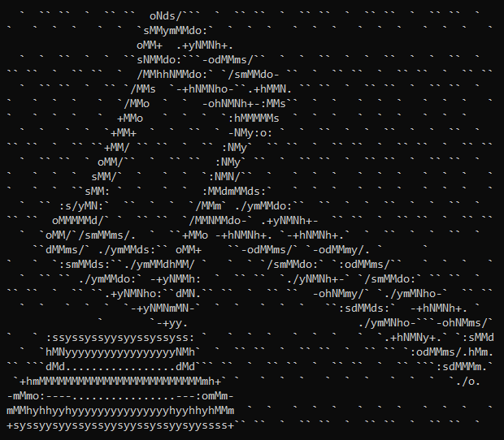

# PegasOS - Legal, Ethical, and Technical

## 2.1.1 Legal - Licensing

PegasOS is planning on using the GNU General Public License, wherein any versions of the license including version 3 are applicable to the releases of PegasOS. This would allow us to monetize aspects of the operating system - such as allowing for donations to the project - but still, keep the goal of Free and Open Source Software front and center. This allows anyone to download the source code and/or operating system for free with no obligation to pay and allow them to make any modifications to said source code on their own behalf. Part of this licensing will require getting an agreement with UCF and CECS to disclaim the copyright on PegasOS, such that PegasOS remains free and open source. For your convenience, a copy of the GNU General Public License (version 3) is included in the Appendices section.

## 2.1.2 Legal - Source Code Usage

Most if not all code in PegasOS will be procured completely by the PegasOS team, including future teams from UCF and/or future contributors to the repository. In the event that code for the project is not written by the team, it will be code that is open source itself or freely donated to the project by an individual contributor(s) with proper credits to the author(s) of that code. If necessary, contact will be made with those individuals to ensure that their code is not mishandled in any way, and removed upon request.

## 2.1.3 Legal - UCF and CECS Affiliation

Any affiliation with UCF and its mascot, colors, or other trademarks owned and maintained by UCF will be used with their explicit approval that is written and copied into the licensing of the system and all releases of the system. UCF and CECS may assign future teams at their discretion from Senior Design to continue work on the operating system, whether it is from the initial release of PegasOS or the most current release of PegasOS. In this regard, it is recommended that any future teams assigned to this project allow for a Spring to Fall semester timeline, to maximize the amount of time dedicated to modifying the system and ensuring PegasOS is functioning at full capacity.

## 2.1.4 Ethical & Privacy

PegasOS will remain free of any type of mandatory spyware or hidden record collection of any kind. This is defined as follows:

- There will be no such software that tracks the users actions or otherwise collects data based on the users actions, without the users explicit approval and understanding of said software.
- There will be no such software that transmits the current state of the system without the explicit approval of the user, including but not limited to; general system diagnostics such as up-time, power usage, security settings and status, currently installed or running programs, and disk usage.
- There will be no such software that records and stores the user’s inputs into the system for analytical purposes, where input is defined as including but not limited to; text inputs, voice inputs, and video or motion-tracking inputs. This excludes software such as Discord, Skype, or other communication software written by individuals, teams, or companies not affiliated with PegasOS, and any risk from using these software(s) is the responsibility of the user and not PegasOS or its team. This also excludes software such as but not limited to; live text editors, audio streaming services, and video streaming services.
- There will be no such software that records, releases, modifies, copies, deletes, or in any other way affects personal information from the user. PegasOS is not liable for any personal information kept within the system, and the storing, modifying, or otherwise placing of said personal information on the system is at the user’s risk and theirs alone.

In addition to this, PegasOS and its team are not liable for data theft of any kind from the system. During the software’s lifetime and in particular, during its infancy, we cannot guarantee 100% security of the system from malicious users attempting to damage the system, steal information from the system, or otherwise modify the system in such a way that is detrimental to the user against or to their knowledge. To the best of our ability, we will provide a secure and stable system, and it is up to the user’s discretion to use the system safely.

[Back - Introduction](1_INTRODUCTION.md) | [Next - Technical Content](3_TECHNICAL_CONTENT.md) | 
[Design Document Home](DESIGN_DOCUMENT.md) | [Documentation Home](../README.md)