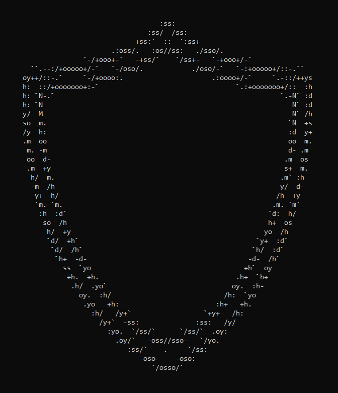
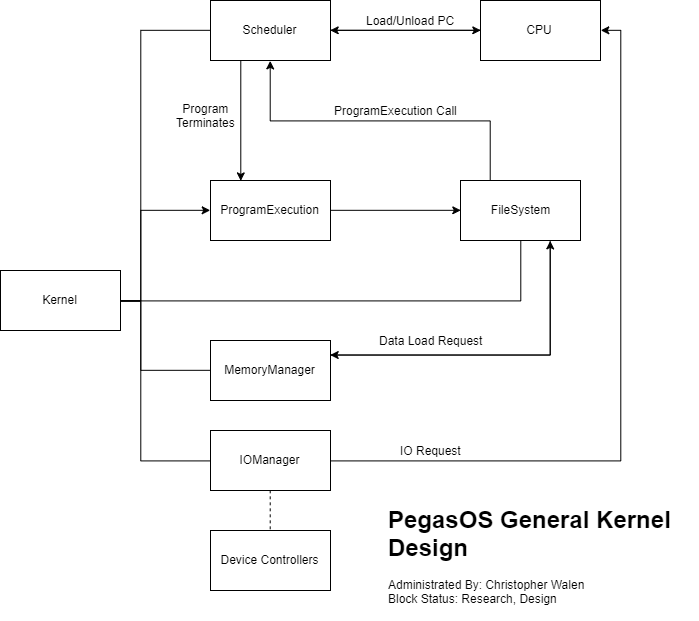
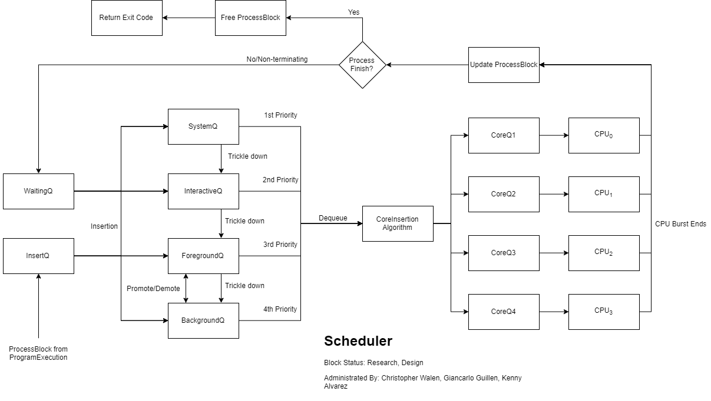
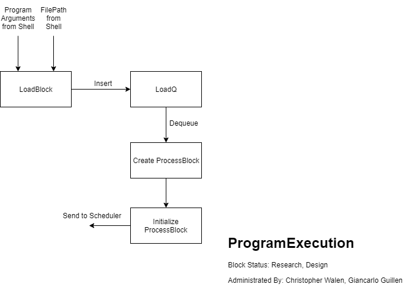
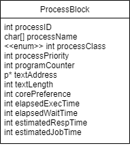
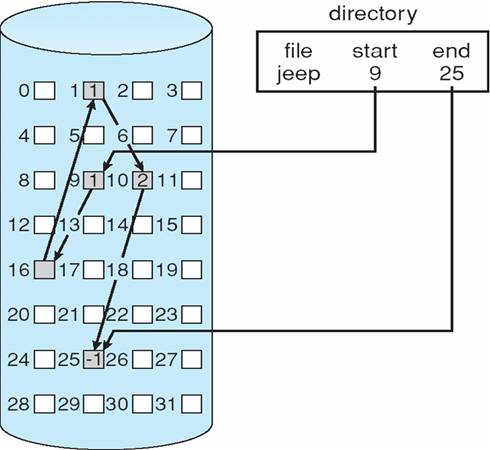
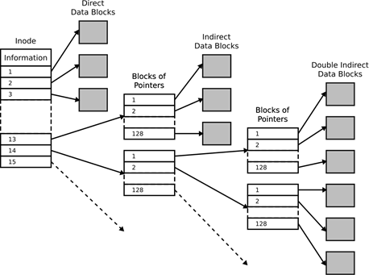
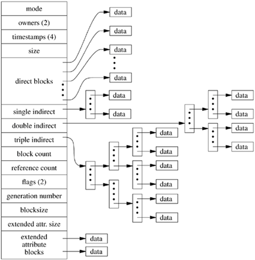
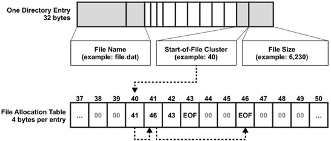

# PegasOS - Kernel

## 6.1 Kernel Design

Overall, the kernel will have a straight-forward layout, made up of a few key components that will do the heavy lifting of the operating system, and the kernel will essentially be a ‘super-manager’ of these components. The main components are as follows: the Scheduler, Program Execution, File System, Memory Manager, and Input/Output Manager. The basic flow of connections between these components is demonstrated in the following diagram.

Implementing the kernel will be tricky, as it has to run on the CPU to start up the rest of the operating system, but the Scheduler is what’s handling processes on the CPU. This means that the kernel will need to spin-up and get all of the initial system processes started and loaded onto the scheduler, then turn itself into a process (or at least copy itself into a process) then run that on the Scheduler.

Because the kernel is the first thing that will run on the Raspberry Pi, it will need to know the addresses of registers and where the Scheduler, Program Execution, Shell, File System, Memory Manager, and Input/Output Manager are residing in memory. One way that we could solve this is to include the shell in the binary for the kernel, then use the shell’s program binary directory for the other managers (Scheduler, ProgramExecution, FileSystem, MemoryManager, and Input/Output Manager) so that the kernel can then spin those up as processes through the ProgramExecution. This means that we will have the following start-up order:

**Kernel Start-Up Order**

1. Kernel
2. Scheduler
3. FileSystem
4. MemoryManager
5. ProgramExecution
6. Shell

This way, the kernel can start the rest of the components in the order that we need them to start functioning. The scheduler has to be started as soon as possible because it is moving processes on and off of the CPU constantly, and apart from our boot-up sequence it is primarily responsible for process execution on the CPU. Which means that ProgramExecution will need to start up next, so that we can bundle those processes. However, ProgramExecution needs the Memory Manager to have already spun up so that it can load text into pages to grab those page addresses for the ProcessBlock, and the Memory Manager won’t know exactly where to look and how to read the discs without the File System in place.

This means that the File System must spin-up immediately after the Scheduler has started, and from there the Memory Manager can spin-up and talk to the File System, and finally, the ProgramExecution can talk to the Memory Manager. The last component that the kernel will start is the Shell itself, which will need the rest of the system to be ready before we can allow the user to interface with it.

During step 1 of the start-up, any other initialization or component spin-up that the kernel needs for operation will happen during that step. If the component becomes too large or too important in function, then it will be moved into a separate component that ties into the kernel and receives a position in this start-up list. 

# 6.2 Kernel Components

## 6.2.1 Scheduler

The scheduler uses a Multi-Level Feedback Queue to allow for processes of different categories. Using the multiple levels, we can create a hierarchy within the process ‘types’ themselves to allow for priority insertion to take place on the CPU. This will allow us to have system or kernel processes done in time before other processes need that information. For example, a file system request can be handled before a program that needs to access that file.

It is important to note that the initial implementation of this scheduler will not be making use of all of the cores on the processor unless time allows for it. However, the design of the scheduling algorithm is based around having multiple cores to better prepare for moving the operating system over to true multi-core processing. 

To achieve the best optimization possible while observing priority among the processes, we’ve broken up the scheduler into four distinct queues that have precedence over the following queues; the SystemQ, InteractiveQ, ForegroundQ, and BackgroundQ. What this means is that the SystemQ has higher priority over the InteractiveQ, and if we are currently working in another queue when a system process is reinserted back into the SystemQ, we will suspend the current process and move back to the SystemQ.

The following contains a more detailed breakdown of each queue:

***SystemQ***

This queue is for kernel or system-level processes, such as page swapping, scheduling, etc. SystemQ uses a First-Come-First-Serve sort (or First In First Out if you prefer), to allow system processes to finish executing before moving on to the next one such that no system process is waiting on data from another system process, or tries to access the same piece of the system at the same time. Insertion into this queue will be very straight forward, and keep runtime for this queue very quick.

***InteractiveQ***

This queue is for processes that require the user’s attention constantly for its operation, such as a game or text editor. The InteractiveQ uses a Bucket Sorting algorithm, wherein the buckets are filled based on priority, then sorted based on the Shortest Reaction Time of the processes. The InteractiveQ also allows for the aging of processes to change their priority within the InteractiveQ such that no process is starved. Due to the bucket sort implementation for priority within the queue, the runtime will suffer slightly but the programs that require a higher response time will be granted a higher priority, so that they get worked on more frequently.

***ForegroundQ***

This queue is for processes that are ‘on the screen and active’. In this case where we do not have a Graphical User Interface and instead have a Command Line Interface, this will be the program(s) that are running on the shell. The shell itself will either be running in the ForegroundQ as well or as a System-level process. The ForegroundQ also uses a Bucket Sorting algorithm, wherein the buckets are filled based on priority, then sorted based on the Shortest Job First among the processes. The ForegroundQ also allows for processes to be  demoted to the BackgroundQ, as well as aging processes to change their priority within the ForegroundQ such that no process is starved.

***BackgroundQ***

This queue is for ‘minimized’ processes or non-System daemons that need to be running without the user's input. The BackgroundQ uses a Round-Robin algorithm, wherein each process gets a constant-quantum time slice of CPU time, before moving on to the next process. The BackgroundQ also allows for processes to be promoted to the ForegroundQ, in the case that it is ‘maximized’ and brought to the foreground of the user’s interactive space, or if it is otherwise being starved in the BackgroundQ.

Inserting into these queues will be done in two ways, as shown in the Block Diagram for the Scheduler. Brand new processes that are coming from ProgramExecution will be placed into the InsertQ, while processes that have already passed through the Scheduler at least once will be placed in the WaitingQ. This ensures that there is a feed-in system for the Scheduler to receive new processes, and that the Scheduler can contain processes that it already has control of or access to. From here, the insertion algorithm will look at the process blocks in First In First Out order, and place them into the respective process class queue. The WaitingQ processes will only be reinserted if they are no longer waiting for an interrupt, or if they have asked to be placed back onto the CPU. In the case of the InteractiveQ or the ForegroundQ, the priority of the process will determine which bucket it is then placed into. After insertion from the InsertQ and WaitingQ are done, the SystemQ is looked at first for execution. Execution will be handled in one of two ways.

1. **For single-core usage**, the process will simply feed the CPU the Program Counter and instruction address contained within the ProcessBlock, and the CPU will begin execution until the burst ends. Once the burst ends, we will update the ProcessBlock’s Program Counter and check the process’s status. If it is waiting for Input/Output or is otherwise waiting or suspended, it will be placed on the WaitingQ for reinsertion. If the process has terminated, the Scheduler will broadcast the termination code to the ProgramExecution (in the case of a non-system process) such that it can report to the user or shell how the process ended.
2. **For multi-core usage**, each core on the CPU will be given a separate CoreQ that will allow processes to be queued for the given core. If a process is being put onto a core for the first time, we will update the ProcessBlock such that it has a ‘preference’ for being placed on a particular core. This is to prevent recaching cores every time that we reload a process onto that core for execution. Once it has moved onto the CoreQ, the CoreQ will be cleared in First In First Out order, feeding the CPU the Program Counter and instruction address for that process. Once the burst ends, we will update the ProcessBlock’s Program Counter and check the process’ status. If it is waiting for Input/Output or is otherwise waiting or suspended, it will be placed on the WaitingQ for reinsertion. If the process has terminated, the Scheduler will broadcast the termination code to the ProgramExecution (in the case of a non-system process) such that it can report to the user or shell how the process ended.

## 6.2.2 Program Execution

The Program Execution loads programs into ProcessBlocks from memory, dealing with the Page Manager as needed, then sends the ProcessBlock off to the Scheduler for CPU execution. This manager will also be what is called through the Command Shell when the user wants to execute programs of their own choosing. 

While the ProgramExecution component is simple in design, it will be communicating with the MemoryManager extensively. This is because it will need to request pages of text from memory, from the PageManager, and to know where the virtual addresses or page addresses of that text reside, to then place in the ProcessBlock. Once the data has been loaded by the MemoryManager and its components, the ProgramExecution will retrieve the text address in the virtual/page space and place that in the ProcessBlock. Then the rest of the ProcessBlock’s information will be initialized and stored, after which the ProcessBlock can be sent off to the Scheduler. In addition to this, the ProgramExecution uses a LoadQ to keep track of which programs have been requested to be executed so that when the ProgramExecution gets CPU time it can remember which programs still need to be bundled up into processes.

The ProcessBlock will contain the following information (subject to modification as needed):

- The process ID is unique to the process - no two processes may have the same ID (even if they are copies of the same program).
- The process name is not used in the algorithms but will be used when the user asks to display what processes are currently in the Scheduler or waiting for execution so that the user can quickly understand what programs are running on the operating system.
- The process class determines which queue in the Scheduler the process will be inserted into.
- The process priority determines which bucket the process will be inserted into if it is inserted into the InteractiveQ or ForegroundQ in the Scheduler.
- The program counter tracks which instruction we are currently working from in the process’ text, and is updated at the end of a CPU burst.
- The text address is the location of the instructions in virtual memory, which will require a page look-up by the Scheduler. If this address is affected in some way by this look-up, it will be updated accordingly so that the code for this process is not lost.
- The text length is a line count of how many instructions make up the code for this program.
- The core preference is triggered when using the multi-core version of the Scheduler, which will tell the core insertion algorithm to insert this process on a particular core instead of the first available core to prevent reaching cores when it is not necessary.
- Elapsed execution time and elapsed waiting time are used to determine if a process needs to be aged, and to inform the user how long a process has been in the Scheduler/CPU track.
- The estimated response time and estimated job time are based on equations related to the length of code and general program execution analysis, to best guess what the needs of the program are for insertion into the InteractiveQ and ForegroundQ in the Scheduler.

## 6.2.3 Interrupt Handler

The Interrupt Handler is a major component of the kernel, as it redirects control from various operations in order to handle requests from various software and hardware.

In the Interrupt Handler there are 5 separate distinct types of of interrupts:

1. Hardware: this is any input from a hardware component being used, ie. keyboard
or mouse.
2. Non-maskable interrupt: these are interrupts that the processor can not ignore
and have the highest precedence.
3. Software interrupts: these interrupts are also called maskable interrupts, these
are occurred through interrupts brought from code being executed thus creating
system calls to create interrupts.
4. Internal interrupt: this interrupt is for the processor runs into an error, ie. file not
found or divided by zero.
5. Reset: this one will simply reset the state of the CPU.

After an interrupt has been received, the Handler must then determine what kind of action must be performed. The appropriate arguments will be set in the Interrupt Control Register, the state of the interrupt caller will be saved, and the Handler will resolve the request. Depending on the type of interrupt received - in this case the ARM exceptions (IRQ and FIQ, please see the Exception Handling section in Hardware for more information), we will need to resolve that request first.

## 6.2.4 Memory Manager

The Memory Manager is a more general manager that has two separate components, the Page Manager and the Virtual Memory Manager. In addition to those components, it will also talk to the Hard Disks/SD cards/Solid State Disks to load instructions from memory when called to do so.

The most hands-on task of the memory manager is cache maintenance. There are specific ARM commands to upkeep the cache, and it is the memory manager’s job to make sure it stays working and clean.

## 6.2.5 Page Manager

The Page Manager swaps memory pages in and out of RAM when necessary, to give running programs the amount of space they require. The mechanics of this lie mostly in the page table design, which can be referenced in Hardware.

## 6.2.6 Virtual Memory Manager

The Virtual Memory Manager handles the allocation of virtual memory. Most of the virtual memory is processed by arm through the MMU, so much of our implementation will just be using ARM. For more information about this process, please refer to the Arm Research section in Hardware.

## 6.2.7 Cache Management

When the MMU is configured, the cache and page table is made. For a more in-depth view on how to set up the MMU, please refer to Hardware . For the cache itself, there are specific ARM commands created to manage the cache. This is in case it needs to be cleaned, or the MMU configuration is updated. In both cases, the cache must be updated as well. There are three different actions you can take with the cache: Invalidation, Cleaning, or Zero.

Invalidation: This clears a cache or a cache line of data. A cache must be invalidated after a reset.

Cleaning: This means writing the lines of the cache that are dirty into external memory and clearing the line.

Zero: This zeroes out the cache without reading the contents from an outer domain.

Most basic cache maintenance is done by the firmware and should not be edited too much. However, the cache can be used to move large amounts of data into a temporary space in which to be loaded. In this case, you would need special operations that a memory manager would handle. However, outside of special cases the firmware handles the rest, so there is no need for a large algorithm to handle this section.

# 6.3 File Systems

## 6.3.1 File System Research

File Systems organize data on the computer such that the user can read and write to it. File Systems act as a storage mechanism which is made for allocating space and organizing how files are saved on storage devices. Without a file system on a storage device, data is placed on it would be just one large block of data with no possible way to tell where a piece of data is, where it stops and where the next piece starts. With a file system separating the data into smaller pieces and naming each of them, it makes it easier to identify most pieces of data in a storage device.

A File System should be able to track available storage space, track which blocks of data belong to which file, create new files, read data from existing files into memory, update data in data, and delete existing files. Other functions for the file system that are practical are assigning names to files and renaming files, having some sort of structure to allow files to be divided into directories and/or folders providing a structure.

For the Raspberry Pi, there are several different file systems that can be used on the Pi and there are some pros and cons for each of them. There is also the option to create a new file system for the Raspberry Pi that we can use but that also has some advantages and disadvantages. There are two main file systems that we considered for PegasOS, those being FAT32 and Ext2.

# 6.4 FAT32

FAT is an acronym for File Allocation Table which was introduced with DOS v1.0. FAT is a file system architecture as well as a family of industry-standard file systems. There are different versions of the FAT system with each being made for different sizes of storage such as FAT12, FAT16, FAT32, and ExFAT. It cannot deliver the same performance as some other modern file systems but continues to be supported for its simplicity and compatibility. FAT32 was introduced with MS-DOS 7.1 / Windows 95 OSR2 in 1996. FAT32 is one of the most popular file systems in the world today, partly due to it being one of the most basic file systems.

FAT32 is compatible with a wide range of devices, including the Raspberry Pi. It is also compatible with almost all operating systems including macOS, Windows, and Linux. The Raspberry Pi’s bootloader is built into the GPU, and only has support for the reading of the FAT file system and using other file systems may require using drivers. One of the biggest limitations for FAT32 is that a single file cannot be greater than 4 GB in size due to its 32-bit nature, and does not include direct built-in support for long filenames. The FAT32 boot sector uses a 32-bit field for the sector count limiting the maximum volume size to about 2 TB with a sector size of 512 bytes. For a sector size of 4,096 bytes, the maximum size volume is about 17.6 TB.

The FAT file system views storage devices as a flat array of clusters. Microsoft designed FAT32 to support an increased number of possible clusters compared to the older versions of the FAT file systems and reuses a majority of the pre-existing code. The cluster values are represented by 32-bit numbers, 28 of those bits are used to hold cluster numbers. If the storage device does not address the data as a flat list of sectors, then the cluster numbers will need to be translated before being sent to the disk. The storage device is organized into three areas: **the boot record , the File Allocation Table** (FAT), and **the directory and data area**.

6.4.1 Boot Record

The boot record is reserved on one sector, and it is arranged in sector zero of the partition. If the storage device hasn’t been partitioned, then it is the beginning of the storage device’s memory. This sector is the easiest to locate for the computer when it’s loaded. If the media was already partitioned, then the MBR (x86) or other partition information are at the start of the media and the partition’s first sector holds a Volume Boot Record.

## 6.4.2 BIOS Parameter Block (BPB)

The boot record contains both code and data that are mixed together and the data that isn’t code is called the BIOS Parameter Block.

| Offset (decimal) | Offset (hex) | Size (in Bytes) | Meaning                                                                         |
| ---------------- | ------------ | --------------- | ------------------------------------------------------------------------------- |
| 0                | 0x00         | 3               | Jump Code                                                                       |
| 3                | 0x03         | 8               | OEM identifier                                                                  |
| 11               | 0x0B         | 2               | The number of bytes per sector (all numbers are in little-endian)               |
| 13               | 0x0D         | 1               | Number of sectors per cluster                                                   |
| 14               | 0x0E         | 2               | Number of reserved sectors. The boot record sectors are included in this value. |
| 16               | 0x10         | 1               | Number of copies of FAT                                                         |
| 17               | 0x11         | 2               | Number of Root Directory Entries (N/A for FAT32)                                |
| 19               | 0x13         | 2               | Number of Sectors in Partition Smaller than 32MB                                |
| 21               | 0x15         | 1               | The media descriptor type                                                       |
| 22               | 0x16         | 2               | Number of sectors per FAT. FAT12/FAT16 only.                                    |
| 24               | 0x18         | 2               | Number of sectors per track                                                     |
| 26               | 0x1A         | 2               | Number of heads or sides on the storage device                                  |
| 28               | 0x1C         | 4               | Number of hidden sectors                                                        |
| 32               | 0x20         | 4               | Number of sectors in partition                                                  |

Source: https://wiki.osdev.org/FAT32
https://www.easeus.com/resource/fat32-disk-structure.htm 

## 6.4.3 Extended Boot Record

The extended boot record comes right after the BPB. The data at the beginning is called the extended BIOS Parameter Block (EBPB). The information it contains depends whether the partition is a FAT12, FAT16, or FAT32. Right after the EBPB is the boot code then the standard 0xAA55 boot signature to fill out the 512-byte boot sector. 

| Offset (decimal) | Offset (hex) | Size (in Bytes) | Meaning                                                                      |
| ---------------- | ------------ | --------------- | ---------------------------------------------------------------------------- |
| 36               | 0x024        | 4               | Number of Sectors per FAT                                                    |
| 40               | 0x028        | 2               | Flags                                                                        |
| 42               | 0x02A        | 2               | Version of FAT32 Drive (Highbytes - Major Version, Lowbyte - Minor Version ) |
| 44               | 0x02A        | 4               | The cluster number of the root directory. Often this field is set to 2       |
| 48               | 0x030        | 2               | The sector number of the FSInfo structure                                    |
| 50               | 0x034        | 2               | The sector number of the backup boot sector                                  |
| 52               | 0x034        | 12              | Reserved                                                                     |
| 64               | 0x040        | 1               | Drive Number of Partition                                                    |
| 65               | 0x041        | 1               | Flags in Windows NT. Otherwise reserved                                      |
| 66               | 0x042        | 1               | Signature (must be 0x28 or 0x29)                                             |
| 67               | 0x043        | 4               | Serial Number of Partition                                                   |
| 71               | 0x047        | 11              | Volume Name of Partition                                                     |
| 82               | 0x052        | 8               | FAT Name                                                                     |
| 90               | 0x05A        | 420             | Executable Boot Code                                                         |
| 510              | 0x1FE        | 2               | Boot Record Signature                                                        |

Source:
https://wiki.osdev.org/FAT32
https://www.easeus.com/resource/fat32-disk-structure.htm

## 6.4.4 File System Info Structure

This is in the second sector of the partition:

| Offset (decimal) | Offset (hex) | Size (in Bytes) | Meaning                                                                  |
| ---------------- | ------------ | --------------- | ------------------------------------------------------------------------ |
| 0                | 0x0          | 4               | Lead signature (must be 0x41615252 to indicate a valid FSInfo structure) |
| 4                | 0x4          | 480             | Reserved, these bytes should never be used                               |
| 484              | 0x1E4        | 4               | Signature of FSInfo Sector                                               |
| 488              | 0x1E8        | 4               | Number of Free Clusters                                                  |
| 492              | 0x1EC        | 4               | Cluster Number of Cluster that was Most Recently Allocated               |
| 496              | 0x1F0        | 12              | Reserved                                                                 |
| 508              | 0x1FC        | 4               | Boot Record Signature                                                    |

Source:
https://wiki.osdev.org/FAT32
https://www.easeus.com/resource/fat32-disk-structure.htm

A cluster is a Group of Sectors on the disk that has information in them. Each Cluster is reserved at the FAT Table and when looking at an entry in the FAT, it tells you if it has data, If it is toward the end of the data, or if another cluster is right after it. if the entry is 0 then there isn’t any data in the current cluster. If the entry is 0FFFFFFF then it’s the last entry in the chain.

## 6.4.5 File Allocation Table

The File Allocation Table is a table stored on the storage device that shows the status and location of all the data clusters that reside on the disk. The cluster may be available for use and the operating system can reserve it. it can also be unavailable because of a bad sector that may be in the storage device or it is likely that it could currently be in use by a different file. Clusters don't have to be near each other, and it would just be distributed all over the disk. The operating system can follow chains of clusters in a file.

FAT32 uses 28 bits to address the cluster on the storage device and the highest 4 bits are reserved. They need to be ignored when reading and unchanged when writing.

This is a example on how a file allocation table works and how they are structured:

Source:
https://www.cs.odu.edu/~cs471w/spring10/lectures/FileSystemImplementation.htm

## 6.4.6 Directory

A directory entry stores information about where a file’s data or a folder’s children are stored on the disk. It also has information like the entry’s name, size, time of creation, extension, address of the first cluster of the directory’s data and the attributes (such as directory, hidden, read-only, system and volume). There are two types of directories for the FAT file system, the standard 8.3 directory entries which appear on all the FAT file systems.

## 6.4.7 Standard 8.3 Format

8.3 filenames are limited to eight characters followed by an extension which is limited to three characters. If the system only supports 8.3 filenames the characters after the limited eight characters are ignored and if there is no extension in the file name, the period if present has no significance in the filename. The root directory regionand in subdirectories are in the following format. 

| Offset (in Bytes) | Length (in Bytes) | Meaning                                                                                                         |
| ----------------- | ----------------- | --------------------------------------------------------------------------------------------------------------- |
| 0                 | 11                | 8.3 file name. The first 8 characters are the name and padded with spaces. Last 3 bytes are the extension.      |
| 11                | 1                 | Attributes of the file.                                                                                         |
| 12                | 1                 | Reserved for use by Windows NT                                                                                  |
| 13                | 1                 | Creation time in tenths of a second (Range 0-199 inclusive)                                                     |
| 14                | 2                 | The time that the file was created. Multiply seconds by 2.                                                      |
| 16                | 2                 | The date on which the file was created                                                                          |
| 18                | 2                 | Last accessed date. Same format as the creation date.                                                           |
| 20                | 2                 | The high 16 bits of this entry's first cluster number. For FAT12/FAT16 this is always zero.                     |
| 22                | 2                 | Last modification time. Same format as the creation time.                                                       |
| 24                | 2                 | Last modification date. Same format as the creation date.                                                       |
| 26                | 2                 | The low 16 bits of this entry's first cluster number. Use this number to find the first cluster for this entry. |
| 28                | 4                 | The size of the file in bytes                                                                                   |

File Creation Time Formatting

| Bits | Meaning |
| ---- | ------- |
| 5    | Hour    |
| 6    | Minutes |
| 5    | Seconds |

File Creation Date Formatting

| Bits | Meaning |
| ---- | ------- |
| 7    | Year    |
| 4    | Month   |
| 5    | Day     |

Source: https://wiki.osdev.org/FAT32

## 6.4.8 Long File Names

Long file names entries are always placed immediately before 8.3 entry. Long Name directory is optional and allows FAT to have longer file names. 

| Offset (in Bytes) | Length (in Bytes) | Meaning                                                               |
| ----------------- | ----------------- | --------------------------------------------------------------------- |
| 0                 | 1                 | The order of this entry in the sequence of long file name entries     |
| 1                 | 10                | The first 5 2-byte characters of this entry                           |
| 11                | 1                 | Attribute. Always equals 0x0F                                         |
| 12                | 1                 | Long entry type. Zero for name entries.                               |
| 13                | 1                 | Checksum generated from the short filename when the file was created. |
| 14                | 12                | The next 6 2-byte characters of this entry.                           |
| 26                | 2                 | Always zero                                                           |
| 28                | 4                 | The final 2 2-byte characters of this entry.                          |

Source: https://wiki.osdev.org/FAT32

# 6.5 Ext2

Ext2 stands for Second Extended File System and it is the rewrite from the Extended File System based around “inodes”. Ext2 was the filesystem for Linux for about a decade from the early 1990s to the early 2000s when it was succeeded by Ext3 and later Ext4.

An inode is an essential concept in the Ext2 file system. Every object that is in the file system is defined by an inode. They don’t contain the actual data that they represent but they contain pointers to blocks that contain the data. With this, the inodes have a defined size which helps them be arranged in indexed arrays. Every block group has an array of inodes and every inode belongs to one block group.

Example of Ext2 inode data structure: 

Source: https://en.wikipedia.org/wiki/File:Ext2-inode.svg

The file system divides the disk into groups called “block groups”. These groups result in the distribution of data across the disk which helps to minimize head movement  and impact fragmentation. Some groups are required to contain backups of data that can be used to rebuild the file system in case of a system failure.

Ext2 divides the disk space into blocks of adjoining space. The blocks don’t need to be the same size as the sector size of the disk Ext2 resides on. The size of the blocks can be determined by reading the field at byte 24 in the superblock.

Blocks are divided into block groups and they are contiguous groups of blocks. Block groups reserve a few of their blocks for purposes such as a bitmap of free and allocated blocks within the group, a bitmap of allocated inodes with the group, a table of inode structures that belong to the group, and some or all block groups may contain a backup copy of the superblock and the Block Group Descriptor Table.

A Superblock contains all the information about the layout of the file system and the configuration of the filesystem. The information the Superblock contains is the number of inodes and blocks being used and how much is free, and the number of inodes and blocks in each block group. It also shows when the file system was mounted, modified, and shows the current version and what operating system it was created on. Implementing an Ext2 driver is to find, extract, and parse the superblock. It is always located at byte 1024 at the beginning of the volume and is 1024 bytes in length.

To determine the number of block groups from the Superblock we must check the size of each block, the total number of inodes, the number of blocks, and the number of inodes in each block group. With this, the number of block groups can be determined by rounding up the total number of blocks divided by the number of blocks per block group or the number of inodes divided by the number of inodes per block group. For added security, we can perform both and check them against each other. 

## 6.5.1 Base Superblock Fields

| Starting Byte | Ending Byte | Size (in Bytes) | Meaning                                                                       |
| ------------- | ----------- | --------------- | ----------------------------------------------------------------------------- |
| 0             | 3           | 4               | Total number of inodes in file system                                         |
| 4             | 7           | 4               | Total number of blocks in file system                                         |
| 8             | 11          | 4               | Number of blocks rseerved for superuser                                       |
| 12            | 15          | 4               | Total number of unallocated blocks                                            |
| 16            | 19          | 4               | Total number of unallocated inodes                                            |
| 20            | 23          | 4               | Block number of the block containing the superblock                           |
| 24            | 27          | 4               | log2 (block size) - 10                                                        |
| 28            | 31          | 4               | log2 (fragment size) - 10                                                     |
| 32            | 35          | 4               | Number of blocks in each block group                                          |
| 36            | 39          | 4               | Number of fragments in each block group                                       |
| 40            | 43          | 4               | Number of inodes in each block group                                          |
| 44            | 47          | 4               | Last mount time                                                               |
| 48            | 51          | 4               | Last written time                                                             |
| 52            | 53          | 2               | Number of times the volume has been mounted since its last consistency check  |
| 54            | 55          | 2               | Number of mounts allowed before a consistency check                           |
| 56            | 57          | 2               | Ext2 signature (0xef53) used to help confirm the presence of Ext2 on a volume |
| 58            | 59          | 2               | File system state                                                             |
| 60            | 61          | 2               | What to do when an error is detected                                          |
| 62            | 63          | 2               | Minor portion of version                                                      |
| 64            | 67          | 4               | Last consistency check                                                        |
| 68            | 71          | 4               | Interval between forced consistency checks                                    |
| 72            | 75          | 4               | Operating system ID from which the filesystem on this volume was created      |
| 76            | 79          | 4               | Major portion of version                                                      |
| 80            | 81          | 2               | User ID that can use reserved blocks                                          |
| 82            | 83          | 2               | Group ID that can use reserved blocks                                         |

Source: https://wiki.osdev.org/Ext2

## 6.5.2 Extended Superblock Fields

Present in Major version if the version is 1 or greater. 

| Starting Byte | Ending Byte | Size (in Bytes) | Meaning                                                             |
| ------------- | ----------- | --------------- | ------------------------------------------------------------------- |
| 84            | 87          | 4               | First non-reserved inode in the file system                         |
| 88            | 89          | 2               | Size of each inode structure                                        |
| 90            | 91          | 2               | Block group that this superblock is part of (if backup copy)        |
| 92            | 95          | 4               | Optional features present                                           |
| 96            | 99          | 4               | Required features present                                           |
| 100           | 103         | 4               | Feature that if not supported, the volume must be mounted read-only |
| 104           | 119         | 16              | File system ID                                                      |
| 120           | 135         | 16              | Volume name                                                         |
| 136           | 199         | 64              | Path volume was last mounted                                        |
| 200           | 203         | 4               | Compression algorithms used                                         |
| 204           | 204         | 1               | Number of blocks to pre-allocate for files                          |
| 205           | 205         | 1               | Number of blocks to pre-allocate for directories                    |
| 206           | 207         | 2               | Unused                                                              |
| 208           | 223         | 16              | Journal ID                                                          |
| 224           | 227         | 4               | Journal inode                                                       |
| 228           | 231         | 4               | Journal device                                                      |
| 232           | 235         | 4               | Head of orphan inode                                                |
| 236           | 1023        | x               | Unused                                                              |

Source: https://wiki.osdev.org/Ext2

## 6.5.3 Block Group Descriptor Table

The Block Group Descriptor Table is an array of block group descriptors that are used to define parameters of all the block groups and it also contains a descriptor for each of them in the file system. The descriptor provides the location of the inode bitmap, inode table, and other important data. The block group descriptor table starts right after the superblock. Depending on how many block groups are defined, the table may require multiple blocks of storage. 

## 6.5.4 Block Group Descriptor Table Structure

| Starting Byte | Ending Byte | Size (in Bytes) | Meaning                               |
| ------------- | ----------- | --------------- | ------------------------------------- |
| 0             | 3           | 4               | Block address of block usage bitmap   |
| 4             | 7           | 4               | Block address of inode usage bitmap   |
| 8             | 11          | 4               | Starting block address of inode table |
| 12            | 13          | 2               | Number of unallocated blocks in group |
| 14            | 15          | 2               | Number of unallocated inodes in group |
| 16            | 17          | 2               | Number of directories in group        |
| 18            | 31          | x               | Unused                                |

Source: https://wiki.osdev.org/Ext2

## 6.5.5 Inodes

Every inode contains a numerical address and it always starts at one. They have a fixed size as defined by the field in the superblock. All inodes are located in inode tables that are in the block group and The size of the inode table is fixed at the time of formatting. Locating an inode is determining what block group it belongs to and indexing that block group inode table.

Each inode contains 12 direct pointers, one singly indirect pointer, one doubly indirect block pointer, and one triply indirect pointer. Space overflows to singly indirect space, then into doubly indirect space, then triply indirect space. If valid, direct block pointers value is non-zero and every pointer is the address for the block containing the data. When a file needs more than 12 blocks, a block is allocated then it stores the rest of the data block’s addresses to store the content. The allocated block is called the indirect block as there is an indirection between the inode and its data. The addresses that are stored in the block are 32-bit and the addresses of the indirect block are called Singly Indirect Block Pointer. If the file needs more blocks that it can’t fit in 12 direct pointers and the indirect block, then a double indirect block is needed. The double indirect block is the extension of a single indirect block with there being two blocks  between the inode and data blocks. If more space is still needed, the file will use the triple indirect block, which is, similar to the double indirect block, it’s another extension. The triple indirect block has the addresses from the double indirect blocks, which has addresses of the single indirect blocks and that has the addresses of the data block.

## 6.5.6 Inode Data Structure

| Starting Byte | Ending Byte | Size (in Bytes) | Meaning                                                    |
| ------------- | ----------- | --------------- | ---------------------------------------------------------- |
| 0             | 1           | 2               | Type and permission                                        |
| 2             | 3           | 2               | User ID                                                    |
| 4             | 7           | 4               | Lower 32 bits of size in bytes                             |
| 8             | 11          | 4               | Last access time                                           |
| 12            | 15          | 4               | Creation time                                              |
| 16            | 19          | 4               | Last modification time                                     |
| 20            | 23          | 4               | Deletion time                                              |
| 24            | 25          | 2               | Group ID                                                   |
| 26            | 27          | 2               | Count of hard links to this inode                          |
| 28            | 31          | 4               | Count of disk sectors in use by this inode                 |
| 32            | 35          | 4               | Flags                                                      |
| 36            | 39          | 4               | Operating system specific value                            |
| 40            | 87          | 48              | Direct block pointers 0-11, each being the size of 4 bytes |
| 88            | 91          | 4               | Singly indirect block pointer                              |
| 92            | 95          | 4               | Doubly indirect block pointer                              |
| 96            | 99          | 4               | Triply indirect block pointer                              |
| 100           | 103         | 4               | Generation number                                          |
| 104           | 107         | 4               | Reserved                                                   |
| 108           | 111         | 4               | Reserved                                                   |
| 112           | 115         | 4               | Block address of fragment                                  |
| 116           | 127         | 12              | Operating system specific value                            |

Source: https://wiki.osdev.org/Ext2

## 6.5.7 Directories

Inodes are directories and they contain entries as their contents, and they are name/inodes pairs. Directories are stored as blocks of data and are referenced by inodes. A directory inode stores the entries as a linked-list in the contents block and the directory entry size may be longer than the length the name would suggest, and the record must be lined up to 4-byte boundaries. The second entry in the inode table contains the inode pointing to the data that belongs to the root directory. Entries can’t span over several blocks in the file system so there might be space between entries. Space is not allowed between entries, any space found will be used for preceding record and increasing record length will include the space. Space may be marked by a different directory entry with inode number zero, implying that the entry should be skipped.

## 6.5.8 Directory Entry Structure

| Starting Byte | Ending Byte | Size (in Bytes) | Meaning                              |
| ------------- | ----------- | --------------- | ------------------------------------ |
| 0             | 3           | 4               | Inode                                |
| 4             | 5           | 2               | Total size                           |
| 6             | 6           | 1               | Name length least-significant 8 bits |
| 7             | 7           | 1               | Type indicator                       |
| 8             | 8 + N - 1   | N               | Name characters                      |

Source: https://wiki.osdev.org/Ext2 

## 6.5.9 Creating a Customized File System

When creating a file system, it must be considered what exactly it will be used for and what functions it will have. The file system is one of the core components of any operating system. While the main functions of a file system are to read a file, write/update the data in a file, and delete files, there are other practical features that go into a file system. Such practical features like:

● Assigning readable names to files and being able to rename them after they have been creating. While this does not make the file system any more efficient or change on how it functions, it is a practical and very common function for any file system that will be used by any person that will be using this operating system. This will make using the file system easier to use and manage data for the user.

● Allowing files to be divided into directories/folders. This is to have some sort of structure for the file system, this is the function that helps keep all the data in a storage device organized, not for the computer but for the user that will be using the operating system.

● Allowing a file to be read-only to prevent corruption of important data within the system.

● Buffering reading and writing to reduce the number of operations on the storage device.

● Providing some sort of security for the file system in order to prevent unauthorized access to the data within the files. Other features that are found in file systems but are not required for a practical file system:

● Automatic encryption - This is to allow the files to be encrypted to protect important data from attackers that have physical access to the computer.

● Journaling of read and write activity - Journaling is when a file system stores every change that was made within the file system. With this feature, it is faster to recover after a force system shutdown and it is less likely that the system or the files will become corrupted. Some of the file systems that have this feature are ext3, ext4, and ReiserFS. There are two methods of writing journals for the file system:

● Physical journals – These are journals that put every change that was ever made into the file system into the journal. This provides protection when a forced shutdown happens because the log can be read and rewrite data based on that and nothing will be lost. This can cause more  time to write to storage but it is a small price when having data protected from data loss or corruption.

● Logical journals – These kinds of journals write metadata every time the journal gets written to. This makes it faster to use than using the physical journaling method but there is an increased likelihood of the journal being corrupted. The system can still recover but cause the metadata and non-journaled data to be out of sync and this can cause the block to be corrupted.

When organizing data with a file system there are different methods to it. With FAT32 and ext2 file systems, they both use different methods when indexing contents of files which makes them different on how they structure data within the storage. Such methods that are commonly used:

● Inodes – Ext2 file system uses this method for indexing their data. They are also called information nodes and are design elements in most Unix file systems. Each file is made of blocks of data which are sectors that contain raw data, index blocks that contain pointers to data blocks, and one inode block. The inode is the root of the index blocks and can be the only index block if the file is small enough. Inodes are good for storing metadata such as file size, creation time, access time, modifications, etc. 

Source: https://flylib.com/books/en/2.849.1.103/1/

● File Allocation Table – FAT32 uses this indexing method for their data. The
general design for the file allocation table is to have a table that holds a list of
blocks and map the capacity of the disk.

Source:
https://www.cs.odu.edu/~cs471w/spring10/lectures/FileSystemImplementation.htm 

# 6.6 PegasOS File System Design

We have decided to use the Ext2 file system for our operating system because it is a file system already made and can be used for the Raspberry Pi 4. The main reason for choosing Ext2 over FAT32 is because FAT32 has many limitations when compared to Ext2 such as file sizes are limited to 4GB.

With every storage device such as a hard drive, flash drive, etc. the space that those drives have gets formatted and divided up into small blocks. The size of those blocks depends on the page size that the processor can support. For the Raspberry Pi 4, it uses the ARM processor and the smallest page size it can support is 4KB and the largest is 64KB. For our operating system, we are going to format the SD card with Ext2 and divide up space with 4KB blocks of space as that is the smallest it can go.

The main reason the blocks must be the smallest available is that the project will be installed on a 16GB SD card and using smaller blocks can help use up more space. With blocks in disk space, when a computer stores files it uses the blocks in the disk and the data in the file is stored in those blocks. When the data is too much for one block, the file system goes to the next available block and stores the data there, when it finishes storing the data the block is then marked that it is the end of the file.

The main problem that happens with storing data like this is that the rest of the block is unusable for other files to use regardless of how much free space is available in that block and using bigger blocks can result in a large amount of wasted free space that can’t be used. For example, if a file that is going to be stored is 9KB in size and the file system is using 8KB blocks to store data, the first free block will be filled and stores the remaining data to the next free block but only a small amount is going to be used and the remaining space in the block can’t use. So, with smaller blocks, there will be less wasted space on the disk but the downside is that with smaller blocks it limits the size a file can be, that won’t be a problem with 4KB blocks as the file size limit is 2TB with the max volume size being 16 TB.

Each inode has a numerical address similar to blocks and their addresses start with 1. Inodes have two fixed sizes, 128 bytes and 256 bytes, depending on if the extra features are implemented or not. For our project, it will have the standard 128-byte structure which contains all the necessary information for files. All inodes are in the inode tables and they are in block groups. To find an inode is to find the block group it belongs to. With the inode address, which is numerical, the group can be determined by using the formula below:

*block group = (inode – 1) / INODES_PER_GROUP*

INODES_PER_GROUP is a field in the superblock. When the block group the inode resides in is determined, to look up the inode within the block group the starting address of the group must be determined. The location of the inode in the block group can be found by using the formula below:

*index = (inode – 1) % INODES_PER_GROUP*

Then once the index is found, the block the inode is in can be determined with using this formula below:

*containing block = (index * INODE_SIZE) / BLOCK_SIZE*

Inside each inode has all the information that is needed about a file such as a file type, size, number of blocks allocated to it, time information such as when it was created, modified, or last accessed, and also has the information about where the blocks of data reside on the disk storage. This is referred to as the metadata and any information that isn’t user data is called that.

One of the most important things about the inode is the use of pointers. Pointers refer to one block in the disk and the pointer itself is about 4 bytes and does not contain any data. Each inode has 12 pointers that directly point to the block that contains the data and in the case of the file being too large for those 12 blocks, the inode will use indirect pointers to get more space. Indirect pointers are used if a file is too big, they point to a block but instead of it containing data they contain more pointers with each pointing to a free block that will contain the data.

The entire block the indirect pointer is pointing at will be full of pointers, with 4KB blocks and each pointer being 4 bytes which means the block will contain 1,024 pointers. This adds to the file size limit to (12 + 1024) * 4KB which equals 4,144KB or just over 4MB. If the file size is still too large, then a double indirect pointer is needed. It works similarly to an indirect pointer except that those pointers in that block point to blocks that contain pointers to blocks that contain the data. This drastically increases the file size limit to (12 + 1024 + (1024 * 1024)) * 4KB which equals about 1 million 4KB or just over 4GB. The file size limit can be increased even further with triple indirect pointers which work similarly to a double indirect pointer but another degree of pointers. This adds the file size limit to (12 + 1024 + (1024 * 1024) + (1024 * 1024 * 1024)) * 4KB  which equals to well over 4TB but in Linux the file size is capped at 2TB. With Ext2, there are no worries about reaching the file size limit or any other size limitations.

With file systems, there is a flow of operations when reading and writing a file that even with small files it can be complicated. For example, within Ext2 there is a file that is 12KB in size so it will take up three blocks on the disk. The “open(“/folder/file”)” must be called but the file system must find the inode that contains the file to get some basic information about it. For the file system, it must traverse the pathname and locate the needed inode. All traversals begin at the root of the file system, the root directory or root inode. The inode number, or its numerical address, for the root inode is always 2 and from there the process of reading the file begins.

Once the root inode is read in, the file system can look to find pointers to blocks. It will read through the directory to find the entry of the folder. By reading in more directory data blocks it will find the entry of the folder then get the inode number for it. After that, the file system will read the block containing the inode and then its directory data to finally find the inode number of the desired file. The final step of “open()” is to read the file’s inode to memory. When the file is open, the program can issue a “read()” system call to read the file. The first read will read the first block then update the last accessed time and the in-memory open file table for the descriptor. The read updates the file offset so the next read can read the second block, etc. Each of these systems calls like “read()” and “write()” generate I/O.

Writing to a file follows a similar process, the file opens then “write()” system calls are issued to update the file. Unlike reading a file, writing to a file might allocate blocks. When writing a new file, each write call not only has to write data to the disk but has to decide which block to allocate for the file and update other structures of the disk-like the inode and the data bitmap. For this, it will generate more I/Os than “read()” calls as it has to read and write the data-bitmaps along with reading and writing the inode and the data blocks.

The number of system calls will increase even further with common operations like file creation. To create a file, the file system must allocate an inode for the file and allocate space within the directory containing the new file. The I/O traffic will increase as it has to read to the inode bitmap, write to the inode bitmap, write to the new inode for the file, update the data of the directory, and to read and write to the directory inode to update it.

If there are problems with using Ext2 on the Raspberry Pi 4 then the backup plan is to create our file system similar to Ext2 on how it works and how it is structured, using inodes. Ext2 is more efficient than FAT32 and there is already supporting software that can help mount Ext2 on the Pi 4.

[Back - System](5_SYSTEM.md) | [Next - Shell](7_SHELL.md) | 
[Design Document Home](DESIGN_DOCUMENT.md) | [Documentation Home](../README.md)