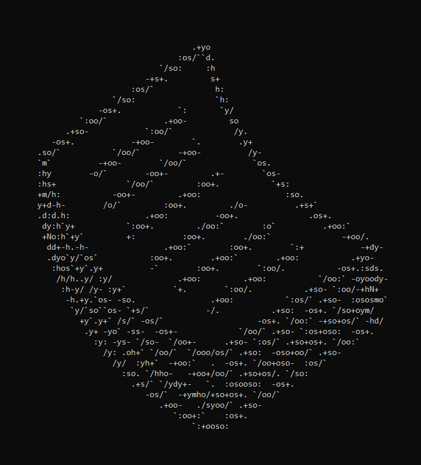
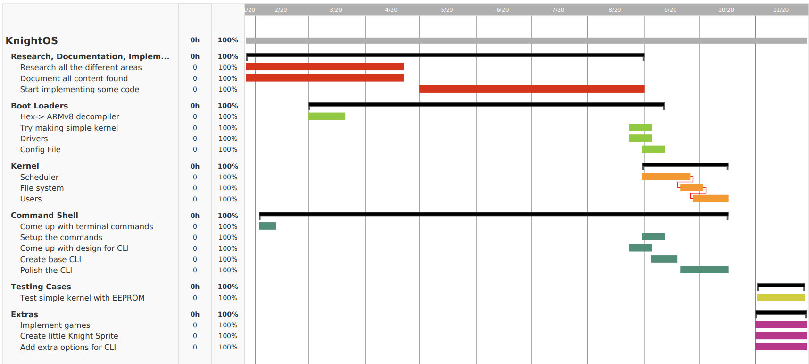

# PegasOS - Administrative Content

# 8.1 Budgeting and Finance

Since our group doesn't have any sponsors for our project, the team fully funded this project by themselves. This somewhat limited our budget since our group is made up of college students that either work part-time or don’t have a job.

We had no predetermined budget for our group, so we want to keep the budget as low as possible. Each team member either bought themselves only the necessary components like the Raspberry Pi, micro HDMI, an SD card or they bought the Raspberry Pi Kit that contains the necessary components plus more like heatsinks and a case. It should be noted that this budget is just estimated since some of our teammates already had a Raspberry Pi before picking out this project. This table shown below contains the estimated finance for this project.

***Project Budget***

| Item             | Price | Quantity | Total Price |
| ---------------- | ----- | -------- | ----------- |
| Raspberry Pi     |       |          |             |
| Micro HDMI Cable | $7    | 1        | $7          |
| Micro SD Card    | $9    | 1        | $9          |
| Raspberry Pi Kit | $75   | 3        | $225        |
|                  |       |          |             |
| Total            |       |          | $241        |

## 8.1.1 Initial Project Gantt Chart

# 8.2 Project Roadmap and Milestones

## 8.2.1 Spring Semester

January - The team is selected, and initial meetings have taken place. Weekly meetings have been scheduled, and the majority of project hardware has been acquired.

February - Project-specific teams are assigned, and specific research areas for each team are assigned. Research Collection and Design begins. Prototypes for smaller designs as needed are created. All hardware has been acquired for the project. Development environments have been set up for testing, prototyping, and implementation purposes.

Important Dates in February:

Feb. 3, 10, 17, 24 - Weekly Team Meetings for Progress, Research, and Documentation

Feb. 7, 2020 - Scheduled Check-In with TA Eric

Feb. 12, 2020 - The Initial Design Document is due

Feb. 24, 2020 - Project Status Presentation with Dr. Heinrich or Dr. Leinecker

March - Detailed designs for components in the operating system are nearing completion. 60% of the predicted research and design for the project has been completed and recorded by the end of the month. Implementation may begin alongside further prototypes.

Important Dates in March:

March 2, 9, 16, 23, 30 - Weekly Team Meetings for Progress, Research, and Documentation

March 2, 2020 - Individual Turn-In of 15 page contributions to Final Design Document

March 30, 2020 - Weekly Team Meeting plus Contribution Check-up

Week of March 30, 2020 - Scheduled Check-In with TA

April - The design of the project is 80-90% complete, with flexibility to reflect sudden changes over the summer months.

Important Dates in April:

April 3, 2020 - Designs are Due for Components

April 6, 2020 - Final Weekly Team Meeting for Progress, Research, and Documentation of the Spring Semester

April 13, 2020 - Tentative Team Meeting slot if necessary

April 17, 2020 - Final Design Document is printed and bound

April 21, 2020 - Final Design Document Due

## 8.2.2 Summer Semester (Original Schedule)

May/June/July - Full speed ahead on implementation as time allows. Iron out kinks in designs that become apparent through implementation. Modify designs if need be, and update Design Document/GitHub to reflect any changes made and why. Ideally, at least 20% of the operating system will be done by the end of the summer.

## 8.2.3 Fall Semester (Original Schedule)

***Note: Specific due dates for Senior Design 2 are unknown at time of writing***

August - Continue work on implementation, with adjustments made for Senior Design 2.

September - At least 40% of the operating system is done by the end of the month.

October - At least 70% of the operating system is done by the end of the month.

November - Final work on the operating system is completed, as well as any final adjustments made to the Final Design Document.

December - The operating system is bundled up as a release, the Final Design Document is printed out and bound. The presentation of the operating system is practiced and given.

# 8.3 COVID-19

No one could have predicted the impact that COVID-19 would have on our school and our day to day schedules, and as such, plans have changed dramatically as the team and school have adjusted to the new circumstances. As such, we have changed some aspects of the Project Schedule, which we will list below. As updates about our situations unfolded, and as the stay-at-home order was made, work on the project was temporarily postponed as we all adjusted to the new circumstances. While we do not know when our routines will return to normal, we can do the best that we can and keep ongoing.

Please keep in mind that the document will undergo more changes as more features and developments arise from the implementation of the project into source code. On the following two pages we have detailed the adjusted project schedule, and details about the new schedule.

## 8.3.1 Remainder of Spring Semester

Finish all sections of the document that have been addressed through our current waves of design and brainstorming. Address key components and issues that may have been missed in previous meetings, and fill in as much information as possible that is necessary to include. Final formatting will be completed at the beginning of the week that the final copy of this document is due, wherein the Table of Contents will be updated to reflect the current state of the document.

## 8.3.2 Summer (May - Mid August)

After the remainder of the primary version of the document has finished, we will hold a ‘mid-term’ review of the current state of PegasOS’s design. Due to the size of the project, this will be necessary to ensure that everyone on the team has a grasp of where we need to go from here as a whole. At the end of this review, we will assign the first wave of tasks to start being implemented. Documentation will be copied and moved to a sister GitHub repository that will link to the source code.

While we are hopeful that normal day-to-day routines will resume over the Summer, we must assume that this will not be the case. Reports are inconsistent about a date for a ‘return to work’, however since online education will be continuing through the entire summer semester, we must also assume that normal routines will not resume until the earliest August. For this reason, we are moving to completely online interactions for meetings until the end of August.

Every week we will have a voice meeting through our Discord channel, screen-sharing and video-sharing where necessary. In these meetings, we will be discussing the current state of the project’s design and implementation. Updates on current work will be presented, and tasks will be delegated and assigned based on completion of previous tasks. As changes are made to the design through issues arising in the implementation, the documentation will be updated to reflect these changes. During these updates, new information may be introduced into the document.

The milestones that we hope to achieve during this timeframe are:

- Boot into the simple kernel
- Display text through GPIO
- Display text through HDMI
- Implement File System
- Implement Memory Manager
- Implement Device Drivers

## 8.3.3 Fall (Late August - Early December)

Once we reach the beginning of the Fall Semester, there will be changes to the project schedule to accommodate the team’s school schedule, as well as the schedule of due dates (if any) as needed by the Senior Design II class. We are hopeful that the number of due dates will remain minimal so that we can continue to focus full-speed on the implementation of PegasOS, as this timeframe will essentially be the second half of the programming required.

An important thing to note about the Fall Semester is that we do not know for sure if the social distancing and the stay-home order will still be in effect, and so we must also assume the ‘worst’ for the Fall Semester. Unless otherwise specified, all meetings will continue to be online through our Discord channel. If we can meet in person on campus, we will have face-to-face meetings as needed.

After the semester has started and we have moved into September, all schedule changes will be done. Based on these changes, we will schedule a day to meet either face-to-face or through Discord. This scheduled day will be a day that every team member is consistently available each week, so that we may have weekly meetings to discuss progress. If progress is advancing rapidly, we may push these meetings back to be bi-weekly if time allows.

The milestones we hope to achieve over this time include:

- Booting into kernel from power-off
- Kernel can schedule and execute processes
- Users can log in to the system
- Users can make system calls to the kernel
- Files stay persistent between boot sessions

# 8.4 Project Summary and Conclusions

## 8.4.1 Summary

PegasOS is a 64-bit operating system designed for the Raspberry Pi 4, and as such it has required a great deal of consideration for its design and an even greater amount of background research for each component in the system. Operating Systems are no easy feat, which has required that each member of the team become the master of their domain, and tackle the various aspects of the system in such a way that every member has a key function in the design and eventual implementation of the system.

At its core, it is made up of several key components that drive the major systems within the kernel. The Input/Output Manager to handle input from keyboards, displays, and other devices. The Memory Manager to handle the swapping of pages in virtual memory, and translating virtual to physical space on disk and in RAM. The Scheduler to send processes to the CPU core(s) for execution. The File System for the storing, reading, writing, and moving of files. The Interrupt Handler for events from software or hardware to allow processes to continue their execution. The Shell to allow users to interact with the system through program execution as well as file and system modification.

PegasOS will have specific future-proofing systems in place to ensure that we are not re-writing the system every time that we wish to include more features or new programs to run on the system. Two examples of this are the Localization Files and their standards, as well as the directory for shell program binaries that allow for easy searching and execution of those programs without having to manually inform the Shell of their existence. Design decisions like these ensure that the system remains extendable and modern, without having to modify system code after the fact.

As a whole, it is an incredible opportunity for us to be able to create this project and this system, and we have all learned a great deal about how these systems function and what design decisions go into making the best possible operating systems. The next step is to begin our implementation of these systems, which will be a long road for sure, but at the end the destination as well as the journey will have been well worth the effort.

## 8.4.2 Conclusions

While optimization is a big aspect of our goals for the system, realistically speaking the operating system must be functional before it can be optimized. First, the system must be operational in 64-bit mode as opposed to the typical 32-bit mode of most Raspberry Pi operating systems, and this will require careful considerations when programming the operating system in the coming months that the design cannot fully accommodate or prepare for until those problems are encountered in implementation.

A problem that we quickly encountered in the design of the system is that many of the systems rely on each other to operate in full capacity, or even to start other necessary systems. This realization has allowed us to attempt to counter this problem early, and section the various components of the operating system into core ‘packs’ that can be completed at once and used to create the next pack of components.

The first of these will be that of the system’s general input and output, the file system, and the memory management. With these systems in place, we can load files from memory for program execution and scheduling, manage processes within memory and the files that the processes need in the page table, and begin development of the shell to interact with the system. All of these systems are built into the kernel as it is developed, so that it can run the system as one monolithic piece of software.

With all of our planning and research in one document that is sure to grow as we discover more about the operating system through its development, we can use it as our master blueprint to create the system that we’ve set out to build. As we find more considerations that we haven’t made, and more designs that must be planned and drawn, we will round out the system and transform it into a functional and educational software and documentation that will guide countless others into the fascinating realm of systems software.

[Back - Shell](7_SHELL.md) | [Next - Appendices](9_APPENDICES.md) | 
[Design Document Home](DESIGN_DOCUMENT.md) | [Documentation Home](../README.md)